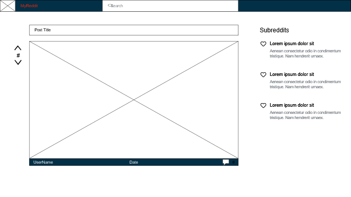
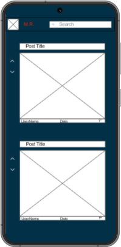
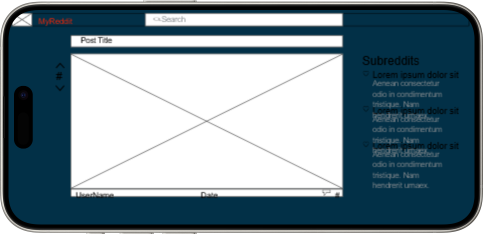

# MyReddit App
View Reddit's contents using Reddit API

## Table of Contents
* [General Info](#general-information)
* [Technologies Used](#technologies-used)
* [Features](#features)
* [Wireframes](#wireframes)
* [Project Status](#project-status)
* [On-going todo's and room for improvement](#On-going-todos-and-room-for-improvement)
* [Acknowledgements](#acknowledgements)
* [Contact](#contact)

## General Information
- This is a CodeAcademy Project about using Reddit API.
- The app will allow users to view and search posts and comments provided by the API.
- The project's purpose is to develop an app from start-to-finish creating a wireframe, using markdown for the README, develop unit and end-to-end tests and use React and Redux.
- This is my first start-to-finish Portfolio Project.

## Technologies Used
- npm ver: 10.8.2
- react ver: 18.3.1

## Features
- Allow users to see posts and comments
- Works on desktop and mobile

## Wireframes

`

## Project Status
Project is: _in progress_ 

## On-going todo's and room for improvement

To do:
- *Section in progress...*

Room for improvement:
- *Section in progress...*

## Acknowledgements
- This project was based on [this CodeAcademy portfolio project](https://www.codecademy.com/projects/portfolio/reddit-client).

## Contact
Created by [@Alberto23B] - feel free to contact me!